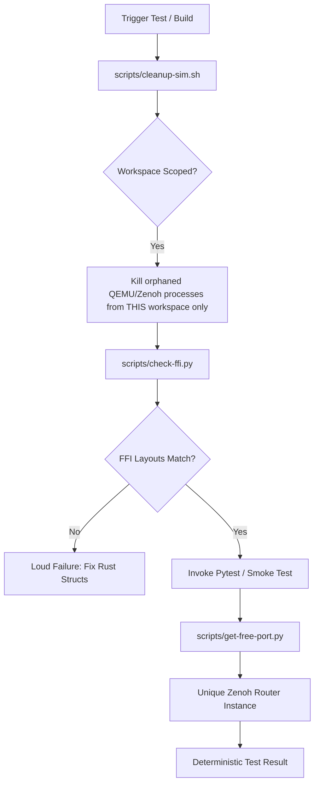

# CI/CD & Reliability Guide

How to understand the optimized CI pipeline, reproduce failures locally, and leverage the automated "Self-Healing" environment.

---

## 1. Reliability Architecture (The "Safe Workspace")

We employ a "Defense in Depth" strategy to ensure that tests are deterministic and parallel-safe, whether running on a multi-core GitHub runner or concurrently by multiple developers/agents on the same machine.

### The Self-Healing Loop

Every time you run a major test target (like `make test-unit` or a CI phase), the environment automatically self-corrects using the following flow:



### Key Safety Mechanisms

#### A. Workspace-Scoped Cleanup (`cleanup-sim.sh`)
Unlike standard cleanup scripts that nuke all processes by name, our cleanup is **Workspace-Scoped**. 
- **Assumption:** Multiple agents or developers may be working on the same machine in different cloned directories.
- **Mechanism:** It inspects `/proc/<pid>/cwd` and `/proc/<pid>/cmdline`.
- **Result:** It *only* kills orphaned processes that originated from your specific directory. You can safely run tests in `/workspace-A` while another simulation is running in `/workspace-B`.

#### B. The FFI Gate (`check-ffi.py`)
To prevent cryptic `SIGSEGV` (Segmentation Faults) caused by layout drift between C (QEMU) and Rust (Plugins).
- **Mechanism:** Uses `pahole` to extract the binary ground truth of struct offsets (like `Chardev` or `Netdev`) directly from the compiled `qemu-system-arm`.
- **Validation:** Compares these offsets against the `assert!` statements in our Rust code. 
- **Mandate:** If the layouts don't match, the build **fails loudly** before the simulation starts.

#### C. Dynamic Port Allocation (`get-free-port.py`)
To enable massive parallelism (`pytest -n auto`) without "Address already in use" errors.
- **Mechanism:** Tests never use hardcoded ports (like 7447). They invoke a utility that finds an available ephemeral port on the host.
- **Result:** Every parallel test worker gets its own isolated Zenoh router and communication bus.

---

## 2. Test Script Assumptions (Do's and Don'ts)

When writing new tests or smoke scripts, adhere to these architectural assumptions:

| Assumption | Safe / Recommended | Dangerous / BANNED |
| :--- | :--- | :--- |
| **Ports** | Use `scripts/get-free-port.py` | Hardcoded numbers (7447, 1234) |
| **Temp Dirs** | Use `tempfile.mkdtemp()` or `/tmp/virtmcu-test-*` | `/tmp/my_test_data` (Fixed path) |
| **Process Ownership** | Trust the Workspace Scoping | `pkill qemu` (Global kill) |
| **QEMU Path** | Use `scripts/run.sh` (Auto-prioritizes build dir) | `/opt/virtmcu/bin/...` (Absolute path) |
| **Cleanup** | Let the fixture/Makefile handle it | Calling `make clean-sim` inside a fixture |

---

## 3. Local vs. GitHub CI Flows

While we strive for 1:1 parity, there are subtle differences in how resources are managed:

| Feature | Local (Native) | GitHub Actions (Containerized) |
| :--- | :--- | :--- |
| **Auth Strategy** | Switch to HTTPS (Self-Healing) | Pre-configured GH_TOKEN |
| **Isolation** | Workspace Scoping (PID namespace shared) | Full Container Isolation (Cgroups) |
| **Stall Timeout** | 5 seconds (Fast feedback) | 120 seconds (Slow runner tolerance) |
| **Cleanup** | Explicitly Workspace-Scoped | Entire runner is wiped after job |
| **FFI Check** | Runs against `third_party/qemu/` | Runs against pre-baked image |

### Reproducing a CI Failure Locally
If a phase fails on GitHub, use the following "Bulletproof Reproduction" steps:
1. Run `make check-ffi` to ensure your layouts are valid.
2. Run `make ci-local` to verify Tier 1 parity.
3. Run the specific phase inside the builder:
   ```bash
   make docker-builder
   docker run --rm -v $(pwd):/workspace -w /workspace -e USER=vscode virtmcu-builder:dev bash scripts/ci-phase.sh <PHASE_NUMBER>
   ```

---

## 4. Pipeline Overview (The 5-Tier Workflow)

Our GitHub Actions pipeline (`ci.yml`) is structured into 5 logical tiers to fail fast and save compute time.

```mermaid
graph TD
    subgraph Tier 1 [Fast Checks - Parallel]
        lint[Static Analysis: ruff, clippy, check-ffi]
        ut[Unit Tests: no QEMU]
    end

    subgraph Tier 2 [Emulator Build]
        bq[Build QEMU & FFI Bindings]
    end

    subgraph Tier 3 [Integration Matrix]
        smoke[Smoke Tests: 20 Phases x 2 Arch]
    end

    subgraph Tier 4 [Validation]
        pcov[Peripheral C Coverage]
        fcov[Guest Firmware Coverage]
    end

    subgraph Tier 5 [Late Publish]
        pub[Merge & Publish multi-arch images]
    end

    Tier 1 --> Tier 3
    Tier 2 --> Tier 3
    Tier 3 --> Tier 4
    Tier 4 --> Tier 5
```

### Tier 1: Fast Static Analysis & Unit Tests (`tier1-checks`)
- **FFI Gate Integration:** `make lint` now automatically triggers `check-ffi`. If you modify a struct in Rust but forget to update the C header (or vice versa), CI will fail here before building QEMU.
- **Zero-Drift Policy:** This job builds a local `devenv-base` to ensure the linting tools (like `pahole`) match exactly what the developers are using.

### Tier 2: Build & Cache QEMU (`build-qemu`)
- **Registry Caching:** We push the intermediate `builder` image to GHCR. Subsequent integration tests `docker pull` this image instantly, bypassing the 40-minute compilation.
- **Staleness Protection:** The build system uses a hash of `patches/` and `VERSIONS` to determine if a full rebuild is required.

### Tier 3: Integration Smoke Tests (`smoke-tests`)
- **Massive Fan-out:** 40 parallel runners execute the phases.
- **Hygiene:** Every phase runner invokes `scripts/cleanup-sim.sh` before starting to ensure no side effects from container layering.

---

## Troubleshooting Guide

| Pattern | Cause | Action |
| :--- | :--- | :--- |
| **`SIGSEGV` in plugin** | FFI Layout drift | Run `scripts/check-ffi.py --fix` |
| **`Address already in use`** | Hardcoded port leak | Switch test to use `scripts/get-free-port.py` |
| **`Permission denied` in /workspace** | UID mismatch | Run `sudo chown -R 1000:1000 .` |
| **Remote push fails** | Broken SSH socket | Re-open container (Self-heals to HTTPS) |
| **CI STALL error** | Runner load spike | Increase `VIRTMCU_STALL_TIMEOUT_MS` |
